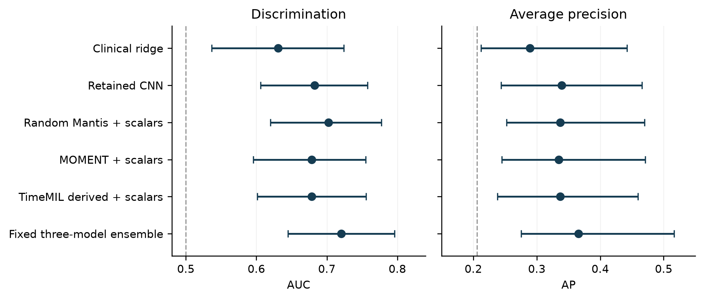

# Early prediction of echocardiographic deterioration during cancer therapy

## Layer specific strain curves and machine learning

Oron Barazani

Advisor Professor Dan Adam

Faculty of Biomedical Engineering, Technion - Israel Institute of Technology

MSc thesis working draft | English | 6 September 2026

This draft develops the research proposal dated 7 September 2025 and the accompanying Israel Innovation Authority background presentation. It incorporates the saved research analyses in the us workspace and relevant project correspondence. The principal completed investigation predicts a subsequent imaging threshold crossing. Clinical cardiotoxicity adjudication, independent hospital validation and prospective utility remain to be established. The title is a working title for advisor review.

## Abstract

Early identification of cardiac deterioration during cancer treatment could support closer surveillance before substantial loss of ventricular function. This thesis investigates whether the spatial and temporal information in layer specific echocardiographic strain curves adds predictive information to global measurements and their longitudinal trajectories. The original proposal envisaged a multicentre system combining physiological quality assessment and machine learning. The completed analyses examined here support a narrower retrospective investigation of the first subsequent decline in midwall global longitudinal strain magnitude.

The processed Ichilov dataset contains 416 exports representing 400 distinct examinations in 103 patients. Examination identifiers distinguish follow-up visits from technical reanalyses. The principal task comprises 238 eligible adjacent-visit predictions, including 49 first crossings of a relative midwall strain decline of at least 15% from the first examination. Models use information available at the current visit to predict the immediately following observed visit. Clinical and trajectory features, engineered layer differences, segment variability, convolutional models, time-series representations and fixed ensembles were compared using three repetitions of five-fold patient-grouped cross-validation.

Recalculation from saved out-of-fold predictions confirmed an area under the receiver operating characteristic curve of 0.631 and average precision of 0.289 for the clinical ridge baseline. A retained attention-based convolutional model achieved 0.683 and 0.339, respectively. An equal-weight ensemble of the convolutional model, a randomly initialized frozen Mantis representation and a TimeMIL-derived model achieved 0.720 and 0.366. Its reported patient-bootstrap 95% intervals were 0.645-0.796 for AUC and 0.275-0.516 for average precision. The paired improvement over the convolutional model remained uncertain. Experiments without Mantis achieved similar average precision, again without conclusive improvement over the clinical baseline.

Layer disagreement and segment heterogeneity provide plausible candidate signals, but the analyses do not establish a reproducible biological warning pattern or a clinically deployable risk estimate. Extensive model exploration, a small patient cohort, measurement variability and incomplete clinical linkage limit inference. The contribution is a reproducible representation and benchmarking framework with explicit temporal targets, accompanied by evidence that further progress requires stronger outcome definition and independent validation as well as model development.

## Abbreviations

| Abbreviation | Meaning |
| --- | --- |
| AP | Average precision |
| AUC | Area under the receiver operating characteristic curve |
| CNN | Convolutional neural network |
| CTRCD | Cancer therapy related cardiac dysfunction |
| DCT | Discrete cosine transform |
| EF or LVEF | Left ventricular ejection fraction |
| Endo and Mid | Endocardial and midwall strain layers |
| FDR | False discovery rate |
| GLS | Global longitudinal strain |
| OOF | Out of fold |
| SZMC | Shaare Zedek Medical Center |
| VVI | Velocity Vector Imaging |

## 1 Introduction

### 1.1 Clinical motivation

Cancer treatment and cardiovascular care increasingly intersect during longitudinal surveillance. An imaging examination may show preserved global pump function while more localized or subtle mechanical changes are developing. This creates an engineering problem as well as a clinical one: which aspects of a repeated echocardiographic examination should be retained, how should changes be measured, and what future outcome can be predicted reliably?

The proposal identifies chemotherapy-related cardiac dysfunction as the application and uses established cardio-oncology guidance as its clinical foundation. Suter and Ewer describe the cardiovascular implications of cancer drugs and the importance of integrating cardiac assessment with cancer treatment [1]. This motivates surveillance but does not imply that every change in a strain measurement is caused by treatment. Loading conditions, acquisition, analysis and other disease processes can contribute to an observed trajectory.

The 2022 European Society of Cardiology guideline uses symptoms, LVEF, GLS and biomarkers in defining and assessing CTRCD [2]. The present investigation does not reproduce that complete clinical assessment. It predicts a particular change in a layer-specific strain measurement. Maintaining this distinction is essential: a useful imaging forecast could support future clinical research even if it is not yet a diagnostic cardiotoxicity model.

### 1.2 Why retain strain curves

A global peak strain value compresses measurements across myocardial regions and across the cardiac cycle. Two examinations may have similar global values while differing in the timing, shape or regional distribution of contraction. Conversely, an apparent regional difference can arise from unstable tracking. A representation that retains the full curve therefore offers additional information and additional opportunities to learn measurement artifacts.

The research hypothesis concerns both transmural and longitudinal structure. Matched Endo and Mid curves describe different sampling layers of the same segment; repeated visits describe the evolution of those curves. Their differences may reveal changes that are attenuated by averaging. This hypothesis leads naturally to comparisons among global measurements, engineered layer differences and models that learn directly from curve tensors.

The Israel Innovation Authority presentation specifically emphasizes differences between myocardial layers and between successive examinations. It also describes earlier work on view classification, segmentation, physiological curve assessment and aortic stenosis. These provide technical background. Their reported accuracies belong to different populations and tasks and are not evidence that future cardiotoxicity has already been predicted at comparable accuracy.

### 1.3 Scope and contributions

The completed work has three connected contributions. First, it organizes vendor exports into a longitudinal dataset in which technical reanalyses can be distinguished from distinct examinations. Second, it formulates an explicit prediction problem with a patient-specific reference measurement, a current-visit information boundary and an immediately subsequent outcome. Third, it compares several representations under common patient-level partitions and examines what information they appear to use.

This draft treats the next-visit experiment as the principal study. Earlier landmark and selected-endpoint analyses are retained as secondary investigations because their populations, horizons and outcome rules differ. Video representation experiments are described as supporting development work. The multicentre and clinical deployment elements of the proposal are discussed as the next validation stage.

## 2 Literature review

### 2.1 Review approach

This is a focused narrative review, updated on 6 September 2026, rather than a systematic review or meta-analysis. The supplied proposal and grant presentation were used to identify seed references. Additional searches addressed layer-specific strain in breast cancer, regional deformation and cardiotoxicity, measurement reproducibility, echocardiographic deep learning, time-series representations and prediction-model validation. Primary journal articles, original method papers and official clinical or reporting guidance were prioritized. Recent preprints are identified explicitly.

The review asks how each source supports the thesis question and where its applicability ends. Differences in treatment, endpoint, prediction time, imaging software and validation population prevent direct ranking of AUCs across publications. The reference audit accompanying this draft records incomplete citations from the presentation rather than silently replacing them with guessed papers.

### 2.2 From global function to a clinical endpoint

Standardized chamber quantification provides the foundation for interpreting ventricular measurements across examinations. The ASE/EACVI recommendations by Lang and colleagues describe acquisition and quantification practices that are relevant to LVEF and cardiac geometry [3]. Consistent measurement definitions are necessary before adding machine learning: the model cannot correct an unrecorded change in what the input or outcome means.

The International Cardio-Oncology Society consensus complements ESC guidance by making the components of cardiovascular toxicity definitions explicit [4]. In particular, preserved LVEF does not by itself exclude subclinical dysfunction, but the interpretation of strain is embedded in a broader clinical definition. The present Mid-GLS threshold should consequently be described as an imaging surrogate. Its layer, aggregation and threshold operator are not automatically interchangeable with conventional GLS criteria [2,4].

There is also a distinction between detecting subclinical change and improving patient outcomes. The randomized SUCCOUR trial compared strain-guided and EF-guided cardioprotection. Its three-year report did not show a significant difference in the primary change in EF between strategies [5]. This does not make strain uninformative; it demonstrates that measurement sensitivity and treatment benefit are separate questions. A predictive model requires evaluation of the decisions it would trigger, in addition to discrimination.

### 2.3 Layer specific deformation in cancer treatment

Chang and colleagues studied layer-specific strain in patients receiving epirubicin and in an experimental model [6]. Their results support the possibility that layer-resolved measurements change before a conventional EF endpoint. The study provides clinical and mechanistic motivation for examining Endo and Mid information separately. It does not validate the particular six-channel tensor, endpoint or classifier used here.

A longitudinal study of 105 patients with breast cancer examined serial layer-specific function according to chemotherapy regimen [7]. Twenty patients developed the study's cardiotoxicity outcome during six months. Endocardial and midmyocardial function changed during follow-up, with greater reductions among patients developing cardiotoxicity. The findings support attention to treatment timing and layer-dependent trajectories. They also show why a single pooled threshold can conceal regimen-specific behavior. The cohort and outcome in that publication are distinct from the local Ichilov dataset despite the similar nominal patient count.

The evidence supports a biologically plausible direction of research without establishing that every layer difference is pathological. A model based on the Endo-Mid gap can respond to both altered mechanics and differential tracking error. Clinical validation therefore needs a measurement-quality component and a reference outcome that is not simply another transformation of the same curves.

### 2.4 Regional information beyond a global average

Demissei and colleagues evaluated segmental strain for predicting CTRCD in women receiving doxorubicin [8]. Adding selected segmental measurements improved prediction beyond a model containing clinical variables and LVEF in that study. This is directly relevant to retaining spatial heterogeneity. It supports comparison against a credible clinical baseline, rather than comparison only against chance.

The local project asks a related but different question. It uses repeated current-to-next-visit predictions and an imaging threshold derived from the first available examination. Its clinical baseline lacks several treatment and cardiovascular variables present in published clinical models. Therefore, a local gain over this baseline would establish added information relative to the available echocardiographic trajectory features, not necessarily relative to comprehensive cardio-oncology risk assessment.

The proposal also cites Yahav and Adam's machine-learning strain study in aortic stenosis [9]. That work supports the technical value of using multiple deformation features beyond a global summary. Pressure overload and cancer-treatment surveillance nevertheless involve different disease mechanisms and case definitions. The aortic-stenosis results are background evidence, not an external validation set for this thesis.

### 2.5 Measurement reproducibility and quality assessment

Farsalinos and colleagues compared GLS measurements across nine vendors [10]. Their inter-vendor study establishes that measurement comparability must be examined rather than assumed. This matters when the development and external-validation hospitals differ in acquisition or analysis systems. A hospital effect can change both predictors and the probability of crossing a strain-defined outcome threshold.

Khamis and colleagues investigated reproducible vendor-independent estimation using first-generation speckle tracking [11]. The paper was published online in December 2015 and appears in the 2016 journal issue, resolving the date ambiguity in the grant slides. It provides methodological context for the laboratory's emphasis on reproducibility. It does not establish that the present VVI exports are vendor-independent or that automated quality rejection is equivalent to expert adjudication.

The grant's physiological curve examples illustrate a useful distinction between normal, pathological and artifactual behavior. However, excluding every unusual curve could remove the very deformation pattern that predicts deterioration. Quality assessment should establish whether a measurement is trustworthy, not enforce a healthy shape. This thesis therefore interprets aggressive outlier removal as a sensitivity analysis rather than as an unquestioned improvement.

### 2.6 Public datasets and contemporary echocardiographic learning

Piñeiro-Lamas and colleagues released a cardiotoxicity dataset for breast cancer patients containing clinical information and tissue Doppler waveforms [12]. The dataset offers a useful reference for transparent data documentation and reproducible cardio-oncology research. Its waveform modality differs from the local segmental Endo and Mid strain curves, so it is not a direct plug-in external test set for the trained local model. It could support a related clinical or multimodal benchmark after the task and data compatibility are examined.

Ouyang and colleagues demonstrated video-based deep learning for automated assessment of cardiac function [13]. The work establishes that echocardiographic video contains learnable information about ventricular function. Predicting current EF and predicting future treatment-associated deterioration are different tasks, however. Strong performance in current-state estimation does not establish a prospective warning signal.

The July 2026 EchoRisk preprint describes a multicentre cardio-oncology benchmark with 422 patients, 1,123 examinations and separate tasks for functional estimation, dysfunction classification and baseline prediction [14]. It is particularly relevant because it separates these tasks explicitly. As a recent preprint, its claims and data-access conditions should be revisited before planning an external experiment. Its baseline-only prediction task also differs from the current thesis's repeated surveillance setting.

### 2.7 Time series representations

MOMENT is a family of pretrained time-series models designed for several downstream tasks [15]. It motivates testing whether a frozen generic representation can be useful when the local labeled cohort is small. In this thesis, the relevant evidence is the performance of the exact saved checkpoint and downstream probe, not the general foundation-model label. Interpolation to the encoder's required length does not create new temporal measurements.

Mantis is a transformer-based time-series classification framework; its revised 2026 paper describes synthetic-data pretraining and classification-oriented representations [16]. The local experiments include pretrained and randomly initialized frozen variants. This control is essential because a random nonlinear representation can itself be useful. The strongest local Mantis component was the random control, so its performance cannot be presented as evidence that Mantis pretraining transfers successfully to echocardiographic strain.

TimeMIL treats multivariate time-series classification as a multiple-instance learning problem [17]. The local adaptation views segment-time patches as instances and combines their information with scalar context. This is a defensible architectural analogy, but the locally simplified implementation should not be described as an exact reproduction of every published component. Attention weights also require empirical validation before being interpreted as a physiological explanation.

Two complementary approaches reduce dependence on a large learned encoder. The catch22 feature set summarizes diverse time-series properties with 22 canonical descriptors [18]. Random Dilated Shapelet Transform represents a series through responses to sampled local patterns at different dilations [19]. These methods motivate tests of whether simple shape statistics or local motifs add information to the CNN and MOMENT components. They do not imply that an individual descriptor has a unique biological meaning.

### 2.8 Reliable evaluation with few patients

Saito and Rehmsmeier explain why precision-recall analysis is informative when positive and negative examples are imbalanced [20]. The present study reports AP alongside AUC because an apparently reasonable ranking may still produce many false alerts. AP is prevalence-dependent, so it cannot be compared across the three endpoint families without considering their different event fractions.

Varoquaux shows that small-sample cross-validation estimates can have substantial uncertainty [21]. Repeating cross-validation reduces dependence on one partition but does not create new independent patients. In this project, hundreds of transitions and thousands of curves remain clustered within 103 people. The number of independently sampled patients, and especially event patients, constrains the strength of performance claims.

Riley and colleagues provide a principled approach to planning sample size for prediction-model development [22]. Their framework moves beyond a simple events-per-variable rule and considers anticipated performance and overfitting. Applying a formal planning calculation to the next clinical study would be more informative than treating the current neural-network parameter count or number of curves as a sufficient sample-size argument.

TRIPOD+AI provides reporting guidance for clinical prediction models using regression or machine learning [23]. PROBAST+AI addresses quality, risk of bias and applicability [24]. These frameworks motivate transparent reporting of participants, predictors, outcomes, missing data, model selection and validation. The present draft uses them as an audit framework; it does not claim formal compliance or a completed independent risk-of-bias assessment.

### 2.9 Research gap

The reviewed literature supports deformation imaging, regional information and machine learning as plausible components of early surveillance. It leaves an important practical gap: whether matched layer curves and their changes improve a clearly defined future prediction over available longitudinal measurements in independent patients. This thesis addresses that gap through controlled internal comparisons. It does not yet resolve whether the added information is transferable across hospitals or whether acting on the score improves clinical outcomes.

## 3 Research objectives

The primary objective is to assess whether layer-specific strain curves and their recent changes add discrimination for the first next-visit Mid-GLS deterioration beyond a clinical and echocardiographic trajectory baseline.

The secondary objectives are to compare engineered and learned representations; determine whether curve length, channels, segment aggregation and quality filters materially alter performance; examine which information families contribute to predictions; and identify candidate changes that occur before, rather than at, the outcome visit.

The translational objective is to specify what is needed for a subsequent independent evaluation at SZMC. This includes a frozen endpoint, harmonized examination linkage, treatment and clinical outcome data, an untouched validation cohort and a clinically meaningful operating threshold. These are objectives for the next study stage, not completed results.

The working hypothesis is that the relative shape, timing and distribution of Endo and Mid curves contain incremental predictive information. A stronger biological hypothesis would require reproducible pre-event changes independent of the strain-derived label and confirmation in another cohort. The current analyses can generate candidates for that stronger test but cannot establish it alone.

## 4 Materials and methods

### 4.1 Study materials and provenance

The principal investigation is a retrospective longitudinal prediction study. This draft reconstructs its methods and findings from saved research outputs. The two supplied documents establish the scientific plan. The us workspace provides preprocessing code, configurations, reports, aggregate tables, saved out-of-fold predictions and presentations. Project emails provide context about transfers, labeling and prospective validation readiness. They are not treated as patient-level clinical outcome evidence.

The primary numerical sources are the structured data and metric tables. Earlier prose files sometimes retain counts from smaller dataset versions. Where these disagree, the draft uses the current structured dataset and records the discrepancy in the evidence audit. The main AUC and AP values were independently recomputed from saved predictions during preparation of this draft. Model training and the complete historical bootstrap procedures were not rerun.

### 4.2 Cohort construction

The current Ichilov export collection contains 416 files and 103 parsed patient identifiers. Grouping by examination identity yields 400 distinct visits. Sixteen technical reanalysis pairs are retained as repeatability information rather than counted as independent follow-up examinations. The visit table contains two patients with two examinations, nine with three, 91 with four and one with five. Recorded examination dates range from February 2017 to September 2025. These dates describe available examinations and do not establish each patient's treatment timeline.

The transfer correspondence described a nominal cohort of 105 patients. The difference between that handover count and the 103 parsed identifiers remains to be reconciled with a clinical manifest. It would be incorrect to infer the identity or exclusion reason of two patients from the directory name alone. No demographic or treatment-distribution table is invented from this transfer description.

The parser metadata reports 59,098 result rows, 36,961 curve rows and 2,145,357 curve samples, including 14,976 segment strain curves, with no parsing failures. Those quantities describe the export representation; they are not the independent sample size. Sixteen of the 400 visits lack EF. The median adjacent-visit interval is approximately 96 days, with a broad range of approximately 17 to 970 days. Thus, the prediction horizon is the next observed visit rather than a fixed calendar duration.

### 4.3 Representation of strain and time

Longitudinal shortening is conventionally represented by negative strain. For the outcome and global trajectory features, the implementation uses strain magnitude. If a baseline measurement is -20% and a later measurement is -17%, the magnitude has declined from 20 to 17, a relative reduction of 15%. This is a three-percentage-point change in strain, not a 15-percentage-point change.

The curve representation preserves segment identity and matched Endo and Mid measurements. The principal CNN tensor contains 18 segments, six channels and 96 normalized cardiac-phase points. The channels are current Endo, current Mid, their difference, change in Endo from the previous visit, change in Mid from the previous visit and change in the layer difference. At a first visit, the absence of a previous examination must be represented consistently and accompanied by the history indicator.

Original curve lengths range from 17 to 156 samples, with a median of 57. Resampling provides a common input shape; it does not turn a sparsely sampled curve into a more precisely measured cardiac cycle. Normalized phase and physical time also answer different questions. Comparisons of timing across visits should retain acquisition and valve-event information when available rather than assume that equal phase always implies equal physiological timing.

### 4.4 Primary outcome and information boundary

Let G(i,t) be the absolute Mid-GLS magnitude for patient i at visit t, with G(i,1) the first available reference. Define relative decline as D(i,t) = 1 - G(i,t) / G(i,1). The first crossing visit is the earliest follow-up visit k for which D(i,k) is at least 0.15. Each transition from t to t+1 is eligible up to and including the transition ending at that first crossing. Transitions after the crossing are excluded. If no crossing is observed, all otherwise valid adjacent transitions are negative.

The predictor at visit t contains current and past information. Its binary target is one only if visit t+1 is the first crossing. Future strain is used to construct the outcome, never as a predictor. The code's primary threshold operator is greater than or equal to 15%; this differs from the strict greater-than operator in the earlier Amber analysis. Endpoint names in scripts containing the word cardiotoxicity do not change the operational definition.

The 400 visits generate 297 adjacent transitions. The first-crossing mask retains 238 transitions: 49 positives and 189 negatives. Each event is associated with a distinct patient. Twenty-six first crossings occur at visit 2, twelve at visit 3 and eleven at visit 4. A visit-2 event can be predicted only from baseline information and therefore cannot demonstrate a within-patient warning trajectory before the event.

The first available examination is a computational baseline. Confirmation that it precedes cancer therapy requires the treatment-date linkage. Moreover, the next observed examination depends partly on surveillance practice. A future fixed-horizon analysis should explicitly handle irregular follow-up, censoring and competing events rather than relabel these transitions as uniform three-month risk.

### 4.5 Feature families and baselines

The clinical feature family contains 27 candidate global and trajectory variables, including current and first-visit Mid-GLS, Endo-GLS and EF; relative changes; history length; elapsed time; recent slopes; and rolling-reference changes. The label clinical ridge refers to an L2-regularized logistic classifier in the principal study. It is not a comprehensive clinical risk score containing treatment doses, comorbidities, biomarkers and symptoms.

The Endo-Mid family characterizes matched layer differences in magnitude, timing, curve correlation and shape, including DCT summaries of phase-dependent differences and changes since the previous examination. Segment-variability features summarize disagreement among regions in peak values, timing and waveform behavior. The scalar input branch of the neural models combines the available clinical and variability context after feature availability screening.

The comparisons include regularized linear models, tree-based models, a scalar multilayer perceptron, a compact convolutional network and the retained attention-pooling CNN. Ablations examine the full six-channel representation, layer-gap-only inputs, separate layers, normalized shapes and alternate segment interactions. The purpose is to determine whether additional structure improves held-out prediction, not merely whether a larger architecture can fit the training cohort.

### 4.6 Time series encoders and ensembles

Frozen encoder experiments extract representations and train a downstream classifier using the development folds. The local MOMENT and Mantis variants are identified by their saved run metadata. Random-initialization controls test whether the pretrained weights themselves add value. TS2Vec-related experiments compare local self-supervised and random representations. TimeMIL-derived models aggregate segment-time instances, while other rounds investigate catch22 descriptors, random dilated shapelets and interval-based representations.

Fixed ensembles average constituent out-of-fold scores using predefined equal weights within the reported experiment. They can benefit from complementary errors even when no constituent dominates every metric. The best-looking combination was nevertheless identified after several rounds on the same cohort. Fixed weights avoid one level of learned-weight fitting but do not remove selection optimism across the overall research process.

A separate code path selects convex ensemble weights on training-patient rows of a previously generated global OOF score table. This is not sufficient to establish fully nested stacking: the base scores for those training rows may come from models that included the outer test patients during base-model training. The learned-weight results are therefore not used as the primary evidence here. A definitive implementation must regenerate all inner training predictions entirely within each outer development partition.

### 4.7 Patient partitions and preprocessing

The principal partitioning procedure uses repeated stratified five-fold cross-validation on patient identifiers, repeated three times. All visits from a patient remain together. The saved assignment table contains exactly one test-fold assignment per patient per repeat, giving 309 patient-repeat assignments. This prevents the straightforward leakage caused by splitting frames, curves or visits from the same person between training and testing.

In the inspected neural training path, a patient-level validation subset is drawn from the outer training patients for model selection, and scalar imputation and robust scaling are fitted on the fitting subset. The CPU path selects usable features within the training partition. However, the neural feature-availability screen is evaluated on the full transition table before splitting. It uses missingness and variability rather than outcome labels, but it still exposes the preprocessing decision to the test distribution. A strict confirmatory rerun should place this screen inside the training fold.

This code inspection supports the principal grouping and transformation design; it is not proof that every historical model checkpoint and all cached representations are free of contamination. The exact source snapshot, checkpoint provenance and full nested processing graph should be frozen and independently reviewed before final submission or external evaluation.

### 4.8 Metrics and statistical interpretation

AUC summarizes positive-negative ranking. AP summarizes precision across recall levels and is reported with the observed event fraction of 49/238, or 20.6%, as a prevalence reference. The Brier score measures squared probability error. Sensitivity and precision among the highest-scoring 20% of transitions provide an example alert-budget analysis; that threshold is not a clinical recommendation.

Later comparison rounds report 95% intervals from 2,000 patient-bootstrap resamples of the saved prediction table. Patients, rather than individual transitions, are the resampling unit. Pairwise differences are more informative than comparing overlapping marginal intervals. These intervals describe uncertainty conditional on the saved models and predictions; they do not fully capture model retraining, cohort selection or the repeated search across architectures and endpoints.

A prevalence-only constant score has a Brier score of p(1-p), approximately 0.164 on this cohort. This is a descriptive reference calculated using the evaluation cohort's prevalence, not an independently estimated deployment model. Several saved classifiers have worse Brier scores despite useful discrimination, which cautions against interpreting their raw scores as calibrated risks. Calibration must be learned using development data and evaluated on untouched patients.

### 4.9 Secondary tasks

The earlier Amber experiment selects one endpoint per patient, requires sufficient longitudinal history, restricts the final interval to at most 180 days and uses a strict greater-than-15% decline. Its full-cohort selected-endpoint analysis contains 71 patients and 15 events. It also evaluates continuous next-GLS error and constructs risk from a predictive distribution. This differs from direct binary classification over 238 eligible transitions.

The early-landmark analysis uses the first two examinations to predict a later outcome. Its incident-deterioration subset contains 76 patients and 17 events. Other outcomes in that report use 101 patients and different event counts. These are reported separately because eligibility and the available prediction horizon change the scientific question.

Pre-event analyses align observations relative to the first crossing and evaluate candidate features before the outcome examination. The 23 patients with events at visits 3 or 4 permit a genuine comparison from two visits before to one visit before the event. Feature ranking and direction selection on the same cohort are exploratory, even when bootstrap intervals exclude chance.

### 4.10 Governance and reproducibility

The source materials describe retrospective use and contain ongoing ethics and data-transfer discussions. This draft does not assert a final approval number, waiver or approval date that was not verified. Those details must be inserted from the approved protocol and institutional records before the thesis is submitted.

The repository contains tools for removing direct identifiers and maintaining mappings. Where a mapping remains, the data should be described as pseudonymized rather than assumed to be irreversibly anonymous. The manuscript reports aggregate results and excludes patient identifiers and mapping contents. Data availability must follow the actual institutional permissions; the presence of code in a workspace does not establish permission to release clinical data.

## 5 Results

### 5.1 Data readiness and consistency

The primary visit table was verified to contain 400 rows, and the transition table was verified to contain 297 rows from 103 patients. Applying the saved primary mask yielded 238 transitions and 49 events. The visit-file SHA-256 matched the value recorded in the principal run metadata. These checks support continuity between the current structured data and the principal saved analysis.

Some descriptive Markdown files retain earlier cohort counts and limitations. The dataset-schema prose, for example, includes a smaller export and visit count than the current metadata. The main descriptive report also contains limitations inherited from an earlier cohort. These inconsistencies are documentation defects rather than evidence that the current structured table contains the smaller cohort. They should be corrected in a later repository documentation pass.

The parser's timing check reports a median absolute difference of approximately 3.44 ms between reconstructed and vendor time-to-peak values and a correlation of approximately 0.994. Agreement between global curve minima and systolic amplitudes is less uniform in the tails. This supports checking the exact peak definition rather than substituting a full-cycle minimum for a systolic endpoint without qualification. It is a technical consistency check, not an independent clinical validation.

### 5.2 Principal model comparison

| Model | AUC with 95% CI | AP with 95% CI |
| --- | --- | --- |
| Clinical ridge | 0.631 (0.537-0.724) | 0.289 (0.212-0.442) |
| Retained CNN | 0.683 (0.606-0.758) | 0.339 (0.244-0.466) |
| Random Mantis plus scalars | 0.702 (0.620-0.777) | 0.337 (0.253-0.470) |
| MOMENT plus scalars | 0.678 (0.596-0.755) | 0.335 (0.245-0.471) |
| TimeMIL derived plus scalars | 0.678 (0.601-0.756) | 0.337 (0.238-0.460) |
| Equal CNN plus random Mantis plus TimeMIL | 0.720 (0.645-0.796) | 0.366 (0.275-0.516) |

Table 1 reports selected models for the same 238-transition primary task. The clinical, CNN and fixed three-component ensemble AUC and AP were independently recalculated from the saved round-3 predictions and matched the source metrics. Confidence intervals are the saved patient-bootstrap estimates for that round. Rows are selected to explain the research progression and are not an exhaustive ranking of all experiments.

The fixed CNN plus random Mantis plus TimeMIL-derived ensemble has the highest AUC among these rows. Relative to the retained CNN, its AUC gain is 0.038 with a reported paired 95% interval of -0.021 to 0.100; the AP gain is 0.026 with an interval of -0.058 to 0.131. Thus, the point estimates suggest complementary information, but the comparison does not establish a stable improvement.

Figure 1. Saved round-3 point estimates and patient-bootstrap intervals. Dashed lines mark AUC 0.5 and the cohort event fraction for AP. These intervals do not incorporate the full uncertainty from repeated model selection. Source: round3_metrics.csv.

### 5.3 Alternative ensembles and probability quality

| Model | AUC with 95% CI | AP with 95% CI |
| --- | --- | --- |
| CNN plus MOMENT plus catch22 | 0.698 (0.622-0.769) | 0.364 (0.264-0.493) |
| CNN plus MOMENT plus RDST | 0.706 (0.630-0.779) | 0.362 (0.262-0.498) |
| CNN plus MOMENT plus DrCIF | 0.699 (0.616-0.775) | 0.363 (0.260-0.502) |

Table 2. Alternative fixed ensembles for the same primary task. Values and patient-bootstrap intervals are from round4_metrics.csv. RDST denotes Random Dilated Shapelet Transform; DrCIF denotes the interval-forest component used in the saved implementation.

The round-4 alternatives show that a result near AP 0.36 does not depend exclusively on the Mantis component. The CNN plus MOMENT plus catch22-based ensemble achieves AUC 0.698 and AP 0.364. Its paired improvement over the clinical baseline is 0.067 in AUC, with a 95% interval of -0.021 to 0.151, and 0.075 in AP, with an interval of -0.053 to 0.177. Neither comparison establishes superiority. The shapelet ensemble has somewhat higher AUC but slightly lower AP, so naming a single unqualified best model would obscure the metric trade-off.

The clinical baseline's Brier score is 0.236, the retained CNN's is 0.224 and the catch22 ensemble's is 0.183. All exceed the cohort-prevalence reference of approximately 0.164. These results indicate that ranking performance should not be presented as reliable absolute probability estimation. Class weighting and model combination can alter the score scale, and calibration remains a separate task.

At the top-20% alert budget, the retained CNN detects 13 of 49 events and produces 35 false positives among 48 alerts. The clinical baseline detects 16 events with 32 false positives. Consequently, the CNN's higher overall AUC does not translate into improved sensitivity at this particular operating point. The grant target of greater than 85% accuracy and specificity has not been demonstrated by these saved results for the principal outcome.

### 5.4 Architecture and representation ablations

The original uniform-pooling CNN achieved approximately AUC 0.664 and AP 0.302. The retained attention configuration improved the point estimates to approximately 0.683 and 0.339 in the later controlled reference. An earlier attention run reported AP 0.333; these are separate saved runs, not values to average or silently interchange.

Removing apical segments did not improve the reported comparison. Aggressive shape-based quality rejection also failed to yield a stable gain, consistent with the possibility that unusual curves contain both error and useful disease-related information. The result does not prove that quality control is unnecessary. It indicates that the tested exclusion rules did not reliably improve this endpoint in this cohort.

Channel ablations did not establish that the layer-gap channel alone is sufficient. Relative to the full representation, the gap-only variant reduced point-estimate AUC and AP, while normalized-shape and separate-layer variants did not establish a consistent advantage. The confidence intervals for the main paired channel comparisons included zero. These results favor retaining the full representation as a practical reference while leaving the biological contribution of each channel unresolved.

Curve-length, kernel-size and segment-interaction experiments produced modest changes rather than a clear breakthrough. A combined interaction variant reached an AUC around 0.702 but lower AP than the retained CNN. Changing interpolation length can alter regularization and optimization without adding information to the original signal; the observed differences should not be interpreted as evidence that the myocardium contains a newly resolved temporal feature at that numerical length.

### 5.5 Generic representations and controls

The random frozen Mantis representation with scalar context achieved AUC 0.702 and AP 0.337. In the saved round-1 comparison, the pretrained Mantis variant and adapter did not improve on this control. The MOMENT frozen representation achieved AUC 0.678 and AP 0.335. The appropriate conclusion is that generic representations can contribute useful features, while successful transfer of the tested Mantis pretrained weights was not established.

The local TimeMIL-derived model with scalar context achieved AUC 0.678 and AP 0.337, whereas its curve-only form was weaker. Other self-supervised and sequence-model experiments did not consistently outperform simpler controls. The collection of negative results is informative: model family or pretraining status alone is not a reliable guide to performance in this small cohort.

### 5.6 Feature contribution and pre-event behavior

The saved non-CNN interpretation analyses identify matched-layer shape and changing layer-gap heterogeneity as candidate contributors. In the stronger mixed ensembles, the MOMENT segment-maximum representation is repeatedly useful in grouped permutation analyses. This is consistent with the possibility that localized or extreme segment behavior adds information beyond a mean representation, but it is also compatible with sensitivity to atypical tracking.

Permutation importance measures model reliance under a chosen perturbation. It is not an estimate of a causal biological effect, and correlated features can substitute for each other. Shapley analyses of the three ensemble components describe their contribution to the ensemble score, not the causal contribution of myocardial layers. The interpretation methods therefore complement prediction results without proving a mechanism.

The event-aligned analysis includes 49 pre-event observations, but only 23 patients have two genuinely pre-event visits. Baseline Endo-GLS magnitude has a reported single-feature AUC of 0.661. Among later events, change in the phase pattern of segmental layer-gap variability has AUC 0.693. These are exploratory, visit-order-aware rankings, not independent estimates for a prespecified biomarker.

Within-patient changes from two visits before to one visit before the event did not survive FDR correction; the minimum reported q value is 0.467. Accordingly, the current evidence does not establish a consistent group-wide evolving warning pattern. It supplies candidates for a prespecified replication study. The baseline dependence of the outcome also requires caution about regression to the mean and mathematical coupling.

### 5.7 Secondary longitudinal analyses

In the Amber selected-endpoint analysis of 71 patients and 15 events, clinical ridge achieved next-GLS MAE 1.882 strain percentage points and AP 0.390. Engineered ridge achieved MAE 1.914 and AP 0.482, while persistence achieved MAE 1.950 and AP 0.295. The CNN did not clearly improve the continuous prediction error. These results suggest that features can alter event ranking without materially improving average strain prediction, but the small selected sample produces broad uncertainty.

The first-two-visit incident-outcome analysis contains 76 patients and 17 events. Adding Endo-Mid features increased AUC from approximately 0.539 to 0.684 and AP from 0.282 to 0.411 in that experiment. The paired intervals for both gains included zero. Its apparent effect size should not be compared directly with the next-visit results because the eligible patients and future target differ.

These earlier analyses explain the evolution of the research question. They do not constitute independent replications because they reuse overlapping patient data. Their results should not be pooled as if they were separate studies.

### 5.8 Supporting video and strain-development work

The video embedding probe report covers 54,255 frames from 67 patients and 260 visits. A random-frame probe showed high view-classification accuracy and high patient-identity classification accuracy. This demonstrates that the representation contains acquisition and person-specific information, making patient separation essential in downstream evaluation. It is not evidence of future deterioration prediction.

The same report found a modest association between intervisit embedding distance and absolute GLS change, while signed GLS change was not associated in that analysis. Such a relationship could reflect physiological change, image quality or acquisition variation. It motivates further study but does not justify an early-warning claim.

Separately, the strain-variability analysis was revised to preserve view identity during aggregation, reinforcing the need for anatomically consistent preprocessing.

## 6 Discussion

### 6.1 Principal interpretation

The completed work supports feasibility of extracting longitudinal layer-specific representations and evaluating them on patients excluded from model fitting. It provides a coherent benchmark in which simple trajectory features, engineered strain descriptors and learned curve representations can be compared. Point estimates favor some mixed representations, but the strongest pairwise comparisons remain uncertain.

This is a meaningful result even without a decisive winning architecture. The project moved from a broad promise of automated early cardiotoxicity detection to a testable imaging-prediction task with an auditable information boundary. It also exposed the limits of the available data. The next improvement should be judged by stronger evidence, not merely by a higher maximum AUC after another round of searching.

### 6.2 What the layer hypothesis currently supports

The Endo-Mid hypothesis has several kinds of supporting observations: engineered layer features can contribute to non-CNN predictions; mixed representations improve some point estimates; and event-aligned analyses nominate changes in layer-gap structure. None of these alone demonstrates that a specific transmural mechanism precedes clinical cardiotoxicity.

The same observations can arise from different explanations. A model may detect early mechanical impairment, baseline susceptibility, regression to the mean, a change in tracking quality or a combination of these. The first-crossing target depends directly on the baseline Mid measurement, so unusually high baseline magnitude can affect the chance of a later relative decline even without a treatment-specific process. Clinical linkage and repeatability-aware analyses are needed to separate these possibilities.

### 6.3 Why further complexity may have limited returns

The dataset contains many curve samples but comparatively few independent patients. Generic encoders can provide a rich feature space, yet their flexibility may exceed the amount of outcome information available to select among representations. The strong random-encoder control suggests that some benefit may come from nonlinear expansion and downstream regularization rather than transferable pretrained physiology.

Ensembles can reduce the impact of individual model errors, which plausibly explains the modest improvement in their point estimates. However, searching many components and combinations on the same OOF labels creates an additional selection process. Confidence intervals conditional on the selected predictions do not remove that optimism. A frozen shortlist evaluated on a new cohort is more informative than increasingly fine distinctions among internally selected models.

### 6.4 Measurement variability and endpoint robustness

Technical reanalyses provide a valuable opportunity to study measurement variability, but they are not equivalent to independent reacquisition. Repeating analysis of the same examination omits some sources of variability introduced by a new scan, altered loading or a different operator. The 16 available pairs therefore inform only part of the error process.

The saved error analysis reports a within-pair standard deviation of approximately 0.94 strain percentage points for its analyzed strain measure. This illustrates that threshold crossings close to the decision boundary may be unstable. A noise simulation can examine sensitivity to an assumed error distribution; it cannot establish a universal physiological ceiling on prediction accuracy. Before adopting a probabilistic label, the measurement model itself should be validated.

Useful next analyses include repeat-confirmed deterioration, thresholds excluding a predefined uncertainty band, and separate evaluation of clinically adjudicated dysfunction. These analyses should be planned before inspecting the external outcomes. Changing the target repeatedly until one gives a favorable AUC would weaken rather than strengthen the thesis claim.

### 6.5 Clinical usefulness and the baseline comparator

The current baseline captures global echocardiographic state and history. It omits verified treatment dose, cardiovascular comorbidity, biomarkers and several other clinical predictors. An incremental gain over this baseline would be an engineering result with potential clinical relevance, but it would not establish superiority over contemporary comprehensive risk assessment.

The low sensitivity at a fixed 20% alert budget and the probability-calibration results constrain immediate clinical interpretation. Before a score could support surveillance, the intended action and acceptable false-alert burden would need to be defined with clinicians. A future validation should report calibration, sensitivity and precision at frozen thresholds and net clinical benefit for a specific decision. No treatment recommendation can be inferred from the present retrospective ranking experiment.

### 6.6 External validation and the multicentre plan

The proposal identifies Ichilov and SZMC as clinical partners. The saved principal outcome tables establish an Ichilov development analysis; they do not establish a completed independent SZMC validation. Correspondence shows continuing work on raw-video transfer, strain labeling, examination dates and clinical spreadsheets. These operational updates explain why external evaluation remains a distinct milestone.

The next study should freeze the preprocessing, feature availability rules, reference measurement, horizon, threshold and model weights using the development cohort. A harmonized SZMC manifest should then link each examination to its patient, date, view, treatment timing and adjudicated outcome. Acquisition and analysis differences should be documented. If the model is adapted using SZMC data, a separate untouched cohort is still needed to evaluate the adapted system.

Missing visits and treatment changes deserve particular attention. A patient may have an earlier scan because of symptoms, an interrupted treatment course or incomplete follow-up. These processes can make the next observed visit informative in ways a fixed-horizon clinical model would not share. External validation should examine both discrimination and the applicability of the observation process.

### 6.7 Limitations

The principal limitations are the small single-centre analytical cohort, the imaging-derived endpoint, incomplete clinical linkage and extensive reuse of the same patients for exploratory model comparisons. Patient-level splitting addresses within-person leakage but does not eliminate model-selection optimism, site-specific effects or biases in cohort assembly.

The first available measurement is not yet verified as pre-treatment for every patient. Follow-up intervals vary substantially. Technical replicates are limited and do not capture acquisition repeatability. Missing EF and data-dependent feature screening introduce additional assumptions. Learned ensemble weights require a more rigorous nested implementation. Individual-feature and subgroup findings are exploratory because many alternatives were examined.

Finally, this manuscript was prepared from saved analyses. The primary metrics and cohort counts were checked, but every historical training run was not reproduced. The final thesis should archive a complete source and environment snapshot and rerun the frozen confirmatory pipeline. These limitations define the boundary of the present findings rather than invalidate the technical framework.

## 7 Conclusions

Layer-specific strain curves can be organized into a reproducible longitudinal prediction framework that preserves segment identity, matched layers and recent changes. In the available Ichilov cohort, selected mixed representations achieved moderate discrimination for a first subsequent Mid-GLS threshold crossing. The strongest fixed ensemble reached AUC 0.720 and AP 0.366, with uncertainty that did not establish a clear gain over the retained CNN.

The work provides candidate evidence that regional and layer-related information is useful, while demonstrating that architecture complexity and pretraining alone do not guarantee improvement. It does not establish clinical cardiotoxicity diagnosis, calibrated risk, an 85% performance target or external generalization. The next decisive step is a frozen, clinically linked and independently validated study with measurement-quality assessment and a prespecified decision context.

## Appendix A Relationship to the original proposal

| Proposed element | Evidence available for this draft | Remaining work |
| --- | --- | --- |
| Collect data from both clinical partners | Processed Ichilov cohort and correspondence about SZMC labeling | Harmonized, outcome-linked external dataset |
| Extract layer-specific strain | Structured exports and longitudinal curve tensors | Confirm acquisition and vendor consistency |
| Classify normal, pathological and artifactual curves | Prior laboratory background and local QC experiments | Independent annotated quality and pathology validation |
| Compare learning approaches | Extensive patient-grouped model comparisons | Freeze shortlist and nested processing |
| Predict early clinical dysfunction | Next-visit strain-surrogate prediction | Clinical adjudication and treatment linkage |
| Multicentre and prospective validation | Planned in proposal and discussed in correspondence | Untouched hospital validation and prospective study |
| Decision support | Research scores and interpretation analyses | Calibration, operating threshold and utility evaluation |

The prior aortic-stenosis and lung-ultrasound examples in the grant presentation are contextual achievements. Their sample sizes and accuracies are deliberately excluded from the oncology results tables.

## Appendix B Reproducibility map

All paths in this appendix are relative to the us workspace. The accompanying source manifest records file hashes for the local evidence used in preparation of the draft.

| Thesis component | Main local source |
| --- | --- |
| Cohort and parser checks | amber_full_105_preprocessed/Ichilov_july_run_metadata.json |
| Visit construction | amber_full_105_preprocessed/Ichilov_july_visits.parquet |
| Primary labels and partitions | cardiotoxicity_next_visit_gpu.py and its results directory |
| Retained CNN and ablations | cardiotoxicity_plateau_models.py and cardiotoxicity_cnn_* results |
| Time-series comparisons | cardiotoxicity_timeseries_round1.py through round4.py |
| Main fixed ensemble | cardiotoxicity_timeseries_round3_results/round3_oof_predictions.parquet |
| Alternative ensembles | cardiotoxicity_timeseries_round4_results/round4_metrics.csv |
| Feature reliance | cardiotoxicity_top_ensemble_feature_importance_results |
| Pre-event trajectories | cardiotoxicity_pre_event_feature_results |
| Secondary endpoint study | amber_full_105_results |
| Secondary landmark study | cardiotoxicity_early_detection_results |

The working draft is intentionally independent of direct patient identifiers. Reproduction of the underlying research requires authorized access to the source data and the original model dependencies. The manuscript renderer only uses aggregate tables and saved prediction metrics; it does not train models or alter research results.

## Appendix C Items required before submission

The following are unresolved author and study-record items, not missing results to be filled by inference. Confirm the final title and institutional thesis format; supply the approved ethics statement and approval identifiers; reconcile the nominal 105-patient transfer with the 103-patient parsed cohort; provide the treatment and demographic manifest; verify pre-treatment baselines; and complete the independent validation status.

For the analysis, freeze an exact code and environment snapshot, move every preprocessing choice inside the development folds, rebuild any learned ensemble through fully nested training, and define one primary comparison before external evaluation. Add a clinical baseline with verified covariates and report calibration and a prespecified operating threshold. Confirm with the advisor which exploratory rounds belong in the main text versus supplementary material.

For the literature, resolve the incomplete older curve-quality and mechanical-dispersion citations in the grant presentation. The item described there as a manuscript in preparation must remain unpublished background unless an actual publication or authorized manuscript is supplied. The focused narrative review should be extended if a formal systematic review is required by the thesis committee.

## References

[1] Suter TM and Ewer MS. Cancer drugs and the heart: importance and management. European Heart Journal 34:1102-1111. 2013. [doi:10.1093/eurheartj/ehs181](https://doi.org/10.1093/eurheartj/ehs181).

[2] Lyon AR et al. 2022 ESC Guidelines on cardio-oncology. European Heart Journal 43:4229-4361. 2022. [doi:10.1093/eurheartj/ehac244](https://doi.org/10.1093/eurheartj/ehac244).

[3] Lang RM et al. Recommendations for cardiac chamber quantification by echocardiography in adults: an update from the ASE and EACVI. Journal of the American Society of Echocardiography 28:1-39.e14. 2015. [doi:10.1016/j.echo.2014.10.003](https://doi.org/10.1016/j.echo.2014.10.003).

[4] Herrmann J et al. Defining cardiovascular toxicities of cancer therapies: an International Cardio-Oncology Society consensus statement. European Heart Journal 43:280-299. 2022. [doi:10.1093/eurheartj/ehab674](https://doi.org/10.1093/eurheartj/ehab674).

[5] Negishi T et al. Cardioprotection Using Strain-Guided Management of Potentially Cardiotoxic Cancer Therapy: 3-Year Results of the SUCCOUR Trial. JACC Cardiovascular Imaging. 2023. [doi:10.1016/j.jcmg.2022.10.010](https://doi.org/10.1016/j.jcmg.2022.10.010).

[6] Chang WT et al. Layer-specific distribution of myocardial deformation from anthracycline-induced cardiotoxicity in patients with breast cancer - From bedside to bench. International Journal of Cardiology 311:64-70. 2020. [doi:10.1016/j.ijcard.2020.01.036](https://doi.org/10.1016/j.ijcard.2020.01.036).

[7] Kim MN et al. Serial changes of layer-specific myocardial function according to chemotherapy regimen in patients with breast cancer. European Heart Journal Open 2:oeac008. 2022. [doi:10.1093/ehjopen/oeac008](https://doi.org/10.1093/ehjopen/oeac008).

[8] Demissei BG et al. Left ventricular segmental strain and the prediction of cancer therapy-related cardiac dysfunction. European Heart Journal Cardiovascular Imaging 22:418-426. 2021. [doi:10.1093/ehjci/jeaa288](https://doi.org/10.1093/ehjci/jeaa288).

[9] Yahav A and Adam D. Early Detection of Left Ventricular Dysfunction With Machine Learning-Based Strain Imaging in Aortic Stenosis Patients. Echocardiography 41:e70007. 2024. [doi:10.1111/echo.70007](https://doi.org/10.1111/echo.70007).

[10] Farsalinos KE et al. Head-to-Head Comparison of Global Longitudinal Strain Measurements among Nine Different Vendors: The EACVI/ASE Inter-Vendor Comparison Study. Journal of the American Society of Echocardiography 28:1171-1181.e2. 2015. [doi:10.1016/j.echo.2015.06.011](https://doi.org/10.1016/j.echo.2015.06.011).

[11] Khamis H et al. Feasibility of reproducible vendor independent estimation of cardiac function based on first generation speckle tracking echocardiography. Journal of Biomedical Engineering and Informatics 2:57; online December 2015. 2016. [doi:10.5430/jbei.v2n2p57](https://doi.org/10.5430/jbei.v2n2p57).

[12] Pineiro-Lamas B et al. A cardiotoxicity dataset for breast cancer patients. Scientific Data 10:527. 2023. [doi:10.1038/s41597-023-02419-1](https://doi.org/10.1038/s41597-023-02419-1).

[13] Ouyang D et al. Video-based AI for beat-to-beat assessment of cardiac function. Nature 580:252-256. 2020. [doi:10.1038/s41586-020-2145-8](https://doi.org/10.1038/s41586-020-2145-8).

[14] Kalliatakis G et al. EchoRisk: A Multicentre Echocardiography Dataset and Benchmark for Cardio-Oncology. arXiv preprint, submitted 1 July 2026. 2026. [doi:10.48550/arXiv.2607.01039](https://doi.org/10.48550/arXiv.2607.01039).

[15] Goswami M et al. MOMENT: A Family of Open Time-series Foundation Models. ICML 2024; arXiv version 3. 2024. [doi:10.48550/arXiv.2402.03885](https://doi.org/10.48550/arXiv.2402.03885).

[16] Feofanov V et al. Mantis: Lightweight Foundation Model for Time Series Classification. ICML 2026; arXiv version 2, first submitted 2025. 2026. [doi:10.48550/arXiv.2502.15637](https://doi.org/10.48550/arXiv.2502.15637).

[17] Chen X et al. TimeMIL: Advancing Multivariate Time Series Classification via a Time-aware Multiple Instance Learning. Original method paper, arXiv. 2024. [doi:10.48550/arXiv.2405.03140](https://doi.org/10.48550/arXiv.2405.03140).

[18] Lubba CH et al. catch22: CAnonical Time-series CHaracteristics. Data Mining and Knowledge Discovery 33:1821-1852. 2019. [doi:10.1007/s10618-019-00647-x](https://doi.org/10.1007/s10618-019-00647-x).

[19] Guillaume A and Vrain C and Elloumi W. Random Dilated Shapelet Transform: A New Approach for Time Series Shapelets. Original arXiv manuscript; subsequent conference publication 2022. 2021. [doi:10.48550/arXiv.2109.13514](https://doi.org/10.48550/arXiv.2109.13514).

[20] Saito T and Rehmsmeier M. The Precision-Recall Plot Is More Informative than the ROC Plot When Evaluating Binary Classifiers on Imbalanced Datasets. PLOS ONE 10:e0118432. 2015. [doi:10.1371/journal.pone.0118432](https://doi.org/10.1371/journal.pone.0118432).

[21] Varoquaux G. Cross-validation failure: Small sample sizes lead to large error bars. NeuroImage 180:68-77. 2018. [doi:10.1016/j.neuroimage.2017.06.061](https://doi.org/10.1016/j.neuroimage.2017.06.061).

[22] Riley RD et al. Calculating the sample size required for developing a clinical prediction model. BMJ 368:m441. 2020. [doi:10.1136/bmj.m441](https://doi.org/10.1136/bmj.m441).

[23] Collins GS et al. TRIPOD+AI statement: updated guidance for reporting clinical prediction models that use regression or machine learning methods. BMJ 385:e078378. 2024. [doi:10.1136/bmj-2023-078378](https://doi.org/10.1136/bmj-2023-078378).

[24] Moons KGM et al. PROBAST+AI: an updated quality, risk of bias, and applicability assessment tool for prediction models using regression or artificial intelligence methods. BMJ 388:e082505. 2025. [doi:10.1136/bmj-2024-082505](https://doi.org/10.1136/bmj-2024-082505).
